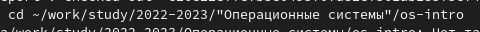
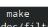
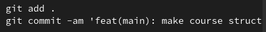
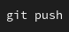

---
## Front matter
lang: ru-RU
title: Презентация по лабораторной работе №3
subtitle: Операционные системы
author:
  - Гашимова Э.Э.
institute:
  - Российский университет дружбы народов, Москва, Россия

## i18n babel
babel-lang: russian
babel-otherlangs: english

## Formatting pdf
toc: false
toc-title: Содержание
slide_level: 2
aspectratio: 169
section-titles: true
theme: metropolis
header-includes:
 - \metroset{progressbar=frametitle,sectionpage=progressbar,numbering=fraction}
---
## Цели и задачи

- Научиться оформлять отчёты с помощью легковесного языка разметки Markdown.
- Сделать отчёт по предыдущей лабораторной работе в формате Markdown.

## Теоретическое введение

Markdown — облегчённый язык разметки, созданный с целью обозначения форматирования в простом тексте, с максимальным сохранением его читаемости человеком, и пригодный для машинного преобразования в языки для продвинутых публикаций.

## Выполнение лабораторной работы

Создаю копию шаблона, в которой буду работать
- открываю созданный файл 
- редактирую его, используя язык рамзетки Markdown 
(рис. 1)
{width=70%}

- работа с библиографией
- вставка ссылок в текст отчета

## Выполнение лабораторной работы

Выполнила компиляцию отчета из формата md в форматы docx и pdf (рис. 2).

{width=70%} 

## Выполнение лабораторной работы
 
 Отправляю отчет на сервер (рис. 3,4).
 {width=70%}
 {width=70%} 
 
## Выводы

При выполнении данной лабораторной работы я научилась оформлять отчеты с помощью легковесного языка разметки Markdown.

# Спасибо за внимание
